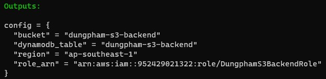
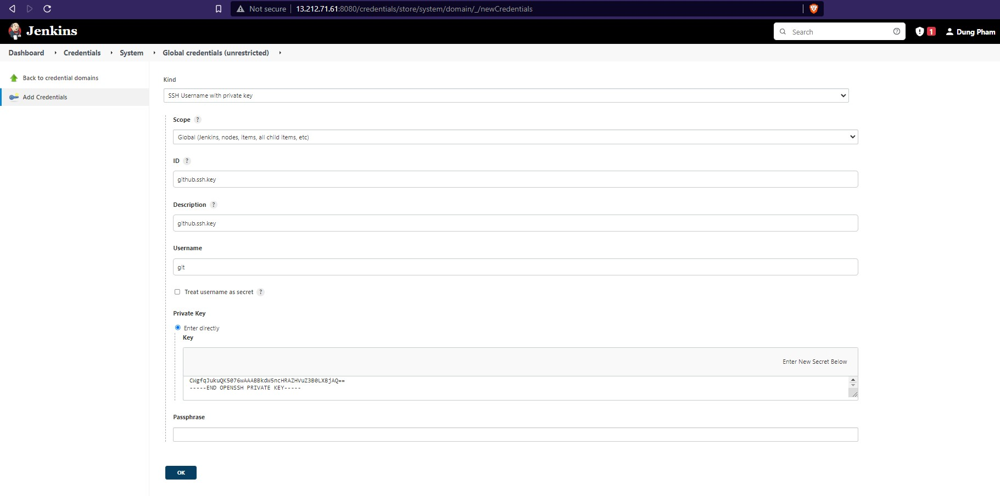
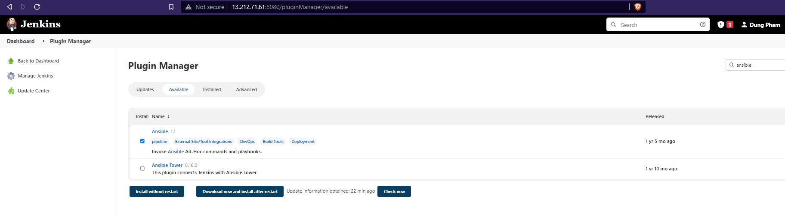
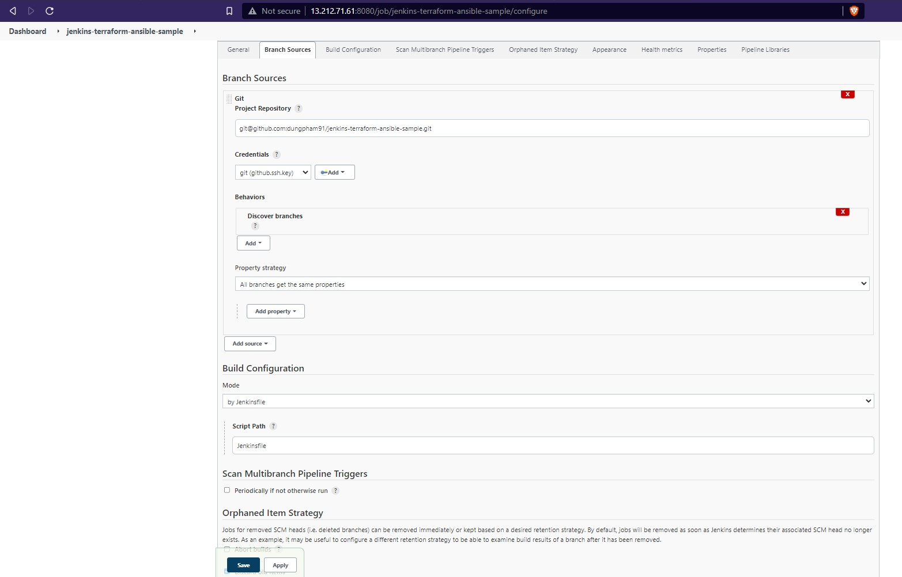
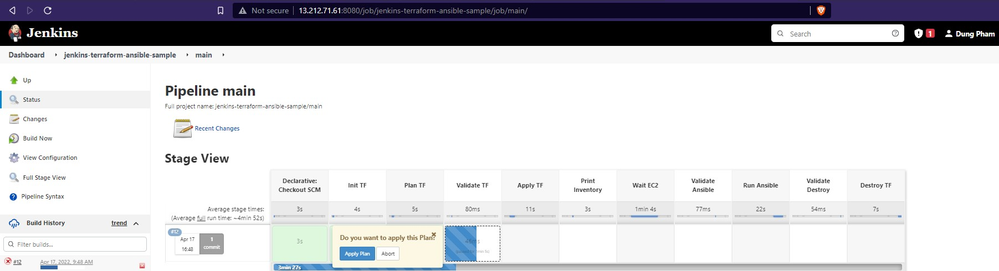
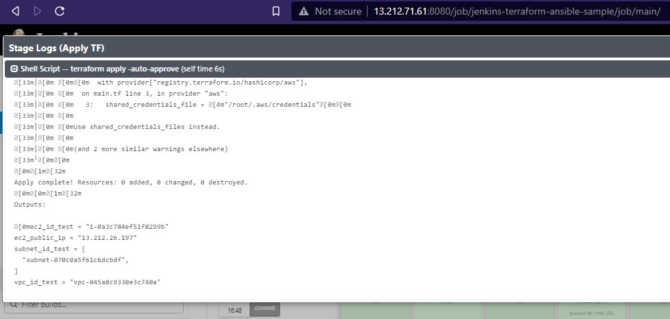
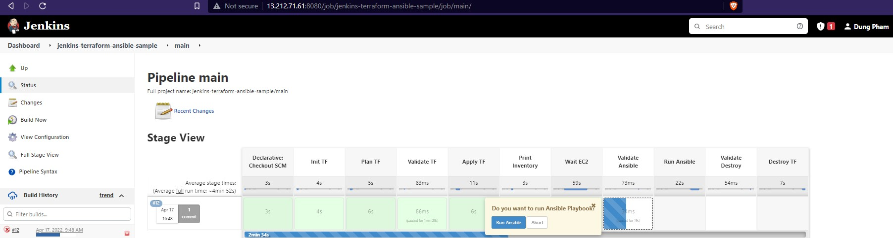
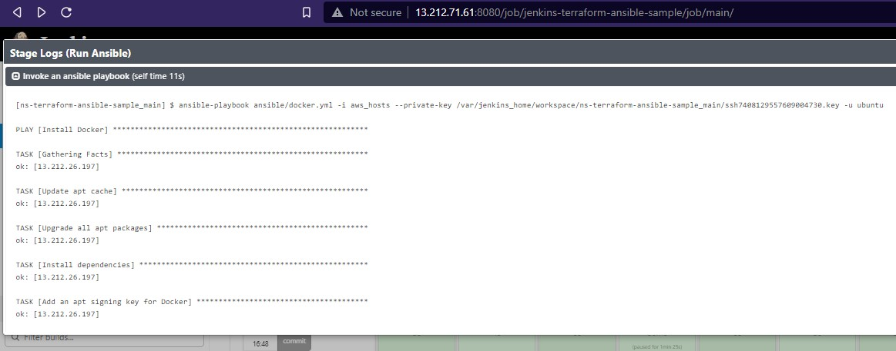
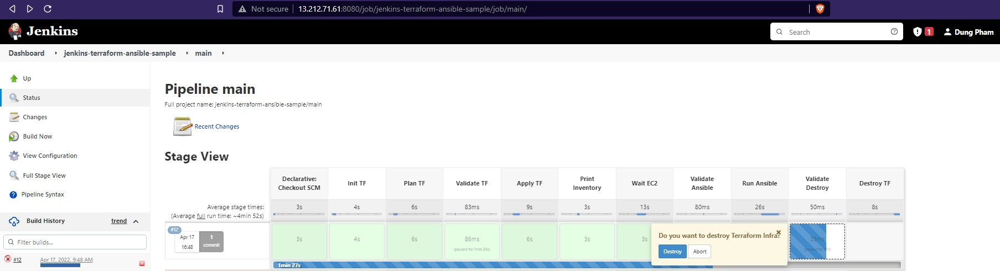

# Auto deploy an app with Jenkins - Terraform -  Ansible

In this sample, we will be automating almost all the steps in the automatic installation of a new Docker server.

Some of the goals of this sample:

- Create S3 bucket to store state for main Terraform code.
- Automate Terraform to create EC2 with Jenkins.
- Automatically generate Inventory for Ansible from Terraform output.
- Jenkins executes Ansible playbook to install Docker on newly created EC2.

(./images/11-pipeline-run-6.jpg)

(./images/12-pipeline-run-7.jpg)

Software version

|  Software |  Version |
|---|---|
| Docker | 20.10.14 |
| Docker Compose | 1.29.2 |
| AWS CLI | 1.19.1 |
|  Terraform | 1.1.8 |
| Ansible | 2.10.8 |
| Jenkins | 2.332.2 |
